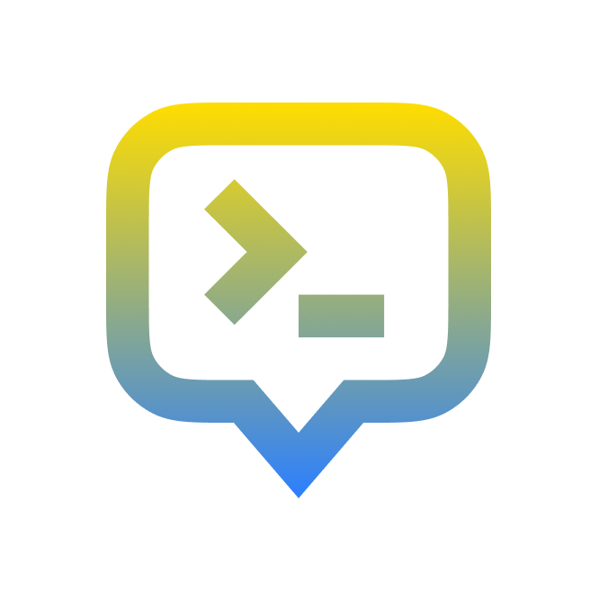

<p align="center">
  
</p>

# PromptMaster

PromptMaster is a premium collection of production-ready AI prompts designed to help you master every domain—from complex coding refactors to high-converting marketing copy. Built as a high-performance monorepo, it serves as a central hub for discoverable, reusable, and professional AI templates.

## ⚙️ Project Links

- ⚙️ Resource → https://github.com/e89wrhi/prompt-master
## 🌟 Features

- **Global Command Search**: Lightning-fast **Cmd+K** (or Ctrl+K) popup interface to find any template in the library instantly with real-time indexing.
- **Categorized Discovery**: Explore professional prompts organized across domains like **Coding, Creative, Education, Marketing, Productivity**, and more.
- **Advanced Filtering**: Navigate a nested architecture that allows you to browse by main topic or drill down into granular subtopics for specific use cases.
- **Standalone Prompt Pages**: Every template features a deep-linkable URL, detailed metadata, usage examples, and high-fidelity markdown rendering.
- **Instant Copy & View**: Optimized workflow with one-click "Copy Template" actions and visual toast feedback for immediate use.
- **Template Editor**: Interactive **Edit Prompt Template** mode to customize variables and structures directly in the browser before deployment.
- **Deep Linking**: Share specific prompts, filtered categories, or search results directly via persistent URL-based state management.
- **Premium UI/UX**: A neutral, minimalist design system supporting seamless **Dark Mode**, fluid layout animations, and full mobile responsiveness.
- **Modern Tech Stack**: Engineered with **Next.js 15**, **React 19**, **Tailwind CSS v4**, and **Lucide Icons** for peak performance.

## 🏗️ Architecture

This repository is structured as a monorepo using [Turborepo](https://turbo.build/):

### Applications

- **`apps/web`**: The main user-facing library where users browse topics and prompts.

### Shared Packages

- **`packages/ui`**: Shared UI component library (Neutral-themed).
- **`packages/lib`**: Shared utilities and type definitions.
- **`packages/typescript-config`**: Shared TypeScript configurations.

## 🚀 Getting Started

### Prerequisites

- [Node.js](https://nodejs.org/) (v18 or higher)
- [npm](https://www.npmjs.com/) 10+

### Installation

1. Clone the repository and navigate into it:

   ```bash
   git clone <repository-url>
   cd prompt-library-client
   ```

2. Install dependencies:
   ```bash
   npm install
   ```

### Development

To start the development servers for all applications:

```bash
npm run dev
```

The web application runs on port `3000`.

## 🛠️ Technology Stack

- **Framework**: [Next.js 15](https://nextjs.org/) (App Router)
- **Language**: [TypeScript](https://www.typescriptlang.org/)
- **Styling**: [Tailwind CSS v4](https://tailwindcss.com/)
- **Icons**: [Lucide React](https://lucide.dev/)
- **Tooling**: [Turborepo](https://turbo.build/), ESLint, Prettier
